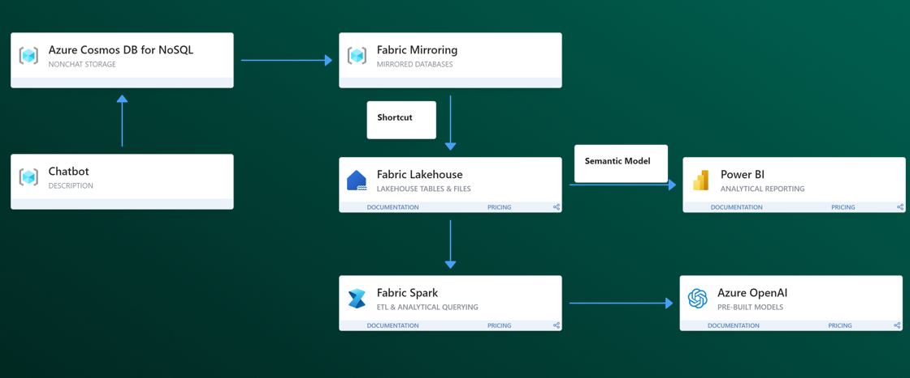

# fabric-cosmosdb-chat-analytics
Microsft fabconeurope2024: Demo material and Fabric notebooks for analyzing chat history stored in CosmosDB NoSQL containers

## Prerequisites

You need the following services to run this notebook.

- [Microsoft Fabric](https://aka.ms/fabric/getting-started) with 64 capacity
- [Azure CosmosDB NoSQL account](https://learn.microsoft.com/en-us/azure/cosmos-db/nosql/quickstart-portal)

You also need to upload chat_history and product catalog information to a Cosmos DB NoSQL database as separate containers. 
- dataset: a sample dataset is provided in the chat_history_data directory. The sample dataset is syntethically generated using gpt-4 mimicking user-chatbot interactions with an e-compercy company. 
- For CosmosDB mirroring, please follow the [documentation](https://learn.microsoft.com/en-us/fabric/database/mirrored-database/azure-cosmos-db).
- For creating a shortcut of mirrored database, please follow the [documentation](https://learn.microsoft.com/en-us/fabric/database/mirrored-database/explore-onelake-shortcut).

## Extracting insights

### Goal: extract product feedback from chat history data. 

### Solution architecture

### Steps
1) Mirror chat history and product catalog data in Fabric OneLake. 
The data for product catalog is found in product_catalog directory and a sample data for chat_history data can be found in chat_history_data directory. Please use the chathistory_all.json. 

2) Create Shortcuts of chat history and product catalog into the Lakehouse

3) Run the analyis Notebook
Navigate to the analysis_notebook directory. 
Open the main_demo notebook and attach the lakehouse and run the notebook. 
bonus: you may run the RAG notbebook to vectorize chat history and ask ad-hoc questions. 

4) Use semantic modeling and powerbi copilot to create a dashboard 

